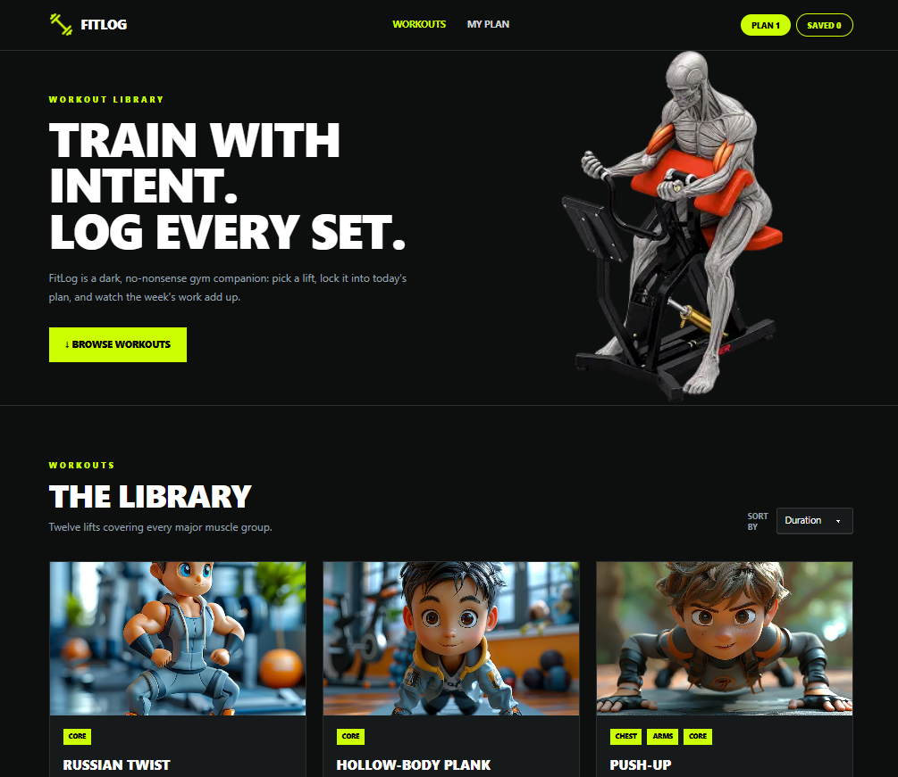

# 🏋️ FitLog — Next.js Workout Tracker

A modern and responsive workout tracking application built with **Next.js App Router, TypeScript, Tailwind CSS, DaisyUI, Context API, and React Toastify**.

FitLog allows users to explore workouts, view exercise details, build a daily workout plan, save workouts for later, track workout metrics, and manage completed exercises through a clean, dark fitness-focused interface.

---

## 🌐 Live Demo

🔗 **Live Website:** [https://fitlog-nextjs-workout-tracker.vercel.app/](https://fitlog-nextjs-workout-tracker.vercel.app/)

🔗 **GitHub Repository:** [https://github.com/Sadekul21/fitlog-nextjs-workout-tracker](https://github.com/Sadekul21/fitlog-nextjs-workout-tracker)

---

## 📸 Project Preview



---

## 📖 About the Project

**FitLog** is a workout library and fitness planning application built with **Next.js**.

Users can browse workout exercises, view detailed workout information, add exercises to Today's Plan, save workouts for later, mark workouts as completed, and track workout totals such as exercises, duration, and calories.

I built this project as part of my learning journey in **full-stack web development**, with a focus on Next.js App Router, TypeScript, API integration, dynamic routing, reusable components, Context API, localStorage, responsive design, and production deployment.

---

## ✨ Features

- 🏋️ **Workout Library** — Browse workouts fetched from an external REST API.
- 🔍 **Workout Details** — View complete workout information through dynamic routes.
- 📋 **Today's Plan** — Add workouts to a daily exercise plan.
- 💾 **Saved Workouts** — Save workouts for later.
- 🔢 **Dynamic Counters** — Navbar Plan and Saved counters update automatically.
- 📊 **Workout Metrics** — Track total exercises, minutes, and calories.
- ✅ **Mark as Done** — Mark planned workouts as completed.
- ❌ **Remove Workouts** — Remove workouts from Plan or Saved.
- 🔔 **Toast Notifications** — Instant feedback for user actions.
- 🔀 **Sorting** — Sort workouts by Duration, Calories, or Rating.
- 💽 **localStorage Persistence** — Keep workout data after page refresh.
- ⏳ **Loading State** — Loading UI while API data is being fetched.
- 🚫 **Custom 404 Page** — Friendly page for invalid routes.
- 📱 **Responsive Design** — Works on mobile, tablet, and desktop.
- 🎨 **Modern Dark UI** — Fitness-focused dark design with neon accent styling.

---

## 🛠️ Tech Stack

| Technology | Purpose |
| --- | --- |
| ▲ Next.js | Main framework and App Router |
| ⚛️ React | Reusable UI components |
| 🔷 TypeScript | Type-safe development |
| 🎨 Tailwind CSS | Styling and responsiveness |
| 🌼 DaisyUI | UI component utilities |
| 🌐 Context API | Shared state management |
| 🔔 React Toastify | Toast notifications |
| 💽 localStorage | Data persistence |
| 🔗 REST API | Workout data fetching |
| 🚀 Vercel | Deployment |
| 🐙 GitHub | Version control |

---

## 🔗 API

The application uses the provided FitLog API.

### All Workouts

```text
https://api.abcz.workers.dev/api/fitlog
```

### Single Workout

```text
https://api.abcz.workers.dev/api/fitlog/:id
```

---

## 📁 Project Structure

```text
fitlog-nextjs-workout-tracker/
│
├── public/
│   └── images/
│       └── fitlog-preview.png
│
├── src/
│   ├── app/
│   │   ├── workout/
│   │   │   └── [id]/
│   │   │       └── page.tsx
│   │   │
│   │   ├── my-plan/
│   │   │   └── page.tsx
│   │   │
│   │   ├── favicon.ico
│   │   ├── globals.css
│   │   ├── layout.tsx
│   │   ├── loading.tsx
│   │   ├── not-found.tsx
│   │   └── page.tsx
│   │
│   ├── assets/
│   │   ├── banner.png
│   │   └── logo.png
│   │
│   ├── components/
│   │   ├── shared/
│   │   │   ├── Navbar.tsx
│   │   │   └── Footer.tsx
│   │   │
│   │   ├── home/
│   │   │   ├── Hero.tsx
│   │   │   ├── WorkoutCard.tsx
│   │   │   └── WorkoutLibrary.tsx
│   │   │
│   │   ├── workout/
│   │   │   └── WorkoutActions.tsx
│   │   │
│   │   └── plan/
│   │       └── PlanWorkoutCard.tsx
│   │
│   ├── context/
│   │   └── FitlogContext.tsx
│   │
│   ├── providers/
│   │   └── AppProviders.tsx
│   │
│   ├── lib/
│   │   └── api.ts
│   │
│   └── types/
│       └── workout.ts
│
├── eslint.config.mjs
├── next.config.ts
├── package-lock.json
├── package.json
├── postcss.config.mjs
├── README.md
└── tsconfig.json
```

---

## 🏠 Main Pages

### Home Page

The Home page includes:

- Hero section with **TRAIN WITH INTENT. LOG EVERY SET.**
- **BROWSE WORKOUTS** CTA
- Responsive workout library
- Workout cards with image, category, equipment, duration, calories, and rating
- Sort dropdown for Duration, Calories, and Rating

### Workout Details Page

Each workout uses a dynamic route:

```text
/workout/[id]
```

The details page includes:

- Workout image
- Title and description
- Categories
- Equipment
- Difficulty
- Sets and reps
- Duration
- Calories
- Rating
- Instructions
- **Add to Today's Plan**
- **Save for Later**

### My Plan Page

The `/my-plan` page includes:

- Today's Plan and Saved tabs
- Exercises, Minutes, and Calories summary
- View Details button
- Mark as Done button
- Remove workout button
- Empty state when no workouts are available

---

## ⚙️ Application Features

### Context API

The React Context API manages shared state across the application, including:

- Today's Plan
- Saved workouts
- Completed workouts
- Navbar counters
- Add and remove actions
- Duplicate prevention
- Workout plan limit

### localStorage

Workout information is stored in browser `localStorage`, allowing Plan, Saved, and Completed data to remain after page refresh.

### Toast Notifications

React Toastify provides feedback for actions such as:

- Adding a workout
- Saving a workout
- Removing a workout
- Marking a workout as done
- Preventing duplicate actions
- Reaching the workout plan limit

### Loading & 404

- Loading UI is shown while API data is being fetched.
- A custom `not-found.tsx` page handles invalid routes.

### Responsive Design

The interface adapts across:

- Desktop
- Tablet
- Mobile

The workout grid, navbar, hero section, action buttons, and workout details layout adjust automatically based on screen size.

---

## 🚀 Getting Started

### Prerequisites

Make sure you have:

- [Node.js](https://nodejs.org/)
- [Git](https://git-scm.com/)

### 1. Clone the Repository

```bash
git clone https://github.com/Sadekul21/fitlog-nextjs-workout-tracker.git
```

### 2. Navigate to the Project

```bash
cd fitlog-nextjs-workout-tracker
```

### 3. Install Dependencies

```bash
npm install
```

### 4. Start the Development Server

```bash
npm run dev
```

### 5. Open in Browser

```text
http://localhost:3000
```

---

## 🏗️ Production Build

Create a production build:

```bash
npm run build
```

Run the production version locally:

```bash
npm start
```

---

## ☁️ Deployment

The application is deployed using **Vercel**.

🔗 **Live Website:**  
[https://fitlog-nextjs-workout-tracker.vercel.app/](https://fitlog-nextjs-workout-tracker.vercel.app/)

The GitHub repository is connected with Vercel, so new commits pushed to the `main` branch can trigger automatic deployments.

---

## 🎯 What I Practiced

While building this project, I practiced and improved my understanding of:

- Next.js App Router
- React Server and Client Components
- TypeScript and TypeScript interfaces
- Dynamic routing with route parameters
- REST API integration and async data fetching
- Reusable React components
- React Context API and `useContext()`
- State management with `useState()` and `useEffect()`
- localStorage persistence
- Conditional rendering
- Array methods such as `.map()`, `.filter()`, `.reduce()`, and `.sort()`
- Responsive design with Tailwind CSS and DaisyUI
- React Toastify notifications
- Loading states and custom 404 pages
- Git, GitHub, production builds, and Vercel deployment

---

## 🤝 Feedback

This project is part of my learning journey in **full-stack web development**.

I'm always open to constructive feedback and suggestions that can help improve the project and strengthen my development skills.

---

## 👨‍💻 Author

**Md Sadekul Islam**

Computer Science Student | Full-Stack Web Development Learner

Currently focused on building practical projects and improving my skills in **JavaScript, TypeScript, React, Next.js, Node.js, APIs, and modern web development**.

---

⭐ If you found this project interesting, feel free to explore the repository and visit the live application.
